# AI Optimize Wealth Strategist

A comprehensive multi-agent AI system for wealth management and financial planning, powered by real-time market data and local LLMs (Ollama).



---

##  Project Overview

**AI Optimize Wealth Strategist** is an intelligent wealth management system that leverages 17 specialized AI agents to provide comprehensive financial analysis, portfolio optimization, and personalized investment recommendations. Built with LangGraph for workflow orchestration and integrated with real-time market data APIs.

### Key Features

- **Multi-Agent AI System**: 17 specialized agents for different aspects of wealth management
- **Real-Time Market Data**: Live data from YFinance, Polygon.io, NewsAPI, Finnhub, and FRED
- **Privacy-First**: Local LLM inference with Ollama (no data sent to external APIs)
- **Technical Analysis**: RSI, MACD, Bollinger Bands, and advanced indicators
- **Comprehensive Reporting**: Detailed Markdown and JSON reports with actionable insights
- **Fast & Efficient**: Optimized workflow with parallel processing capabilities

---

##  System Architecture

The system follows a modular architecture with clear separation of concerns:

```text
ai-optimize-wealth-strategist/
  src/
    agents/              # 17 AI agents
      market_data/       # Market data agents
      news/              # News and sentiment agents
      economic/          # Economic data agents
    data/                # Data models and services
    graph/               # LangGraph workflow
    llm/                 # LLM integration
    tools/               # Utility tools
    utils/               # Helper utilities
  analysis_outputs/      # Generated reports
  pyproject.toml         # Poetry configuration
  env.example            # Environment template
  README.md              # This file
```

### Workflow Architecture

1. **Client Data Loading**: Load client profile and portfolio
2. **Market Data Fetching**: Real-time data from multiple APIs
3. **Agent Execution**: Sequential execution of 17 AI agents
4. **Signal Aggregation**: Collect all agent recommendations
5. **Final Analysis**: Portfolio Manager agent synthesis
6. **Report Generation**: Comprehensive output files

---

##  AI Agents Overview

### Core Wealth Management Agents

| Agent | Purpose | Key Capabilities |
|-------|---------|------------------|
| **Portfolio Manager** | Orchestrates all agents | Workflow coordination, final synthesis |
| **Risk Profiler** | Risk tolerance analysis | Risk assessment, tolerance mapping |
| **Passive Indexing** | Index fund strategies | ETF analysis, passive allocation |
| **Dividend Growth** | Dividend strategies | Dividend analysis, growth stocks |
| **ESG** | Sustainable investing | ESG scoring, impact investing |
| **Factor Investing** | Multi-factor strategies | Factor analysis, smart beta |
| **Global Macro** | Macroeconomic analysis | Economic trends, global markets |
| **Tactical Allocation** | Dynamic allocation | Market timing, tactical shifts |
| **Canadian Core** | Canadian markets | TSX analysis, Canadian stocks |
| **Tax Optimization** | Tax efficiency | Tax-loss harvesting, optimization |
| **Estate Planning** | Legacy planning | Estate strategies, wealth transfer |
| **Retirement Planner** | Retirement planning | Retirement goals, income planning |
| **Insurance Planning** | Insurance needs | Coverage analysis, risk protection |
| **Debt Strategy** | Debt management | Debt optimization, refinancing |
| **Portfolio Auditor** | Portfolio analysis | Performance audit, risk review |
| **Rebalancer** | Portfolio rebalancing | Rebalancing strategies, timing |
| **Sentiment Market Context** | Market sentiment | Sentiment analysis, market mood |

### Market Data Agents

| Agent | Data Source | Purpose |
|-------|-------------|---------|
| **YFinance Agent** | Yahoo Finance | Real-time stock prices, historical data |
| **Polygon Agent** | Polygon.io | US equities, forex, crypto data |
| **Technical Indicators** | YFinance | RSI, MACD, Bollinger Bands, etc. |
| **NewsAPI US Agent** | NewsAPI | Financial news and sentiment |
| **Finnhub Agent** | Finnhub | Company news, press releases |
| **FRED Agent** | Federal Reserve | Economic indicators, macro data |

---

##  Market Data Integration

### Real-Time Data Sources

- **YFinance**: Free stock data with rate limits
- **Polygon.io**: Premium US market data
- **NewsAPI**: Financial news and sentiment
- **Finnhub**: Company-specific news
- **FRED**: Economic indicators (CPI, GDP, rates)
- **Technical Indicators**: Calculated from price data

### Data Processing Pipeline

1. **Data Fetching**: Parallel API calls with rate limiting
2. **Data Validation**: Error handling and fallback mechanisms
3. **Data Structuring**: Normalized format for agent consumption
4. **Caching**: Intelligent caching to reduce API calls
5. **Weekend Handling**: Historical data for off-market hours

---

##  Technical Implementation

### Core Technologies

- **LangGraph**: Multi-agent workflow orchestration
- **Ollama**: Local LLM inference (privacy-focused)
- **Poetry**: Python dependency management
- **Pydantic**: Data validation and serialization
- **Rich**: Terminal output formatting
- **Requests**: HTTP client for API calls

### Performance Optimizations

- **Parallel Processing**: Concurrent API calls
- **Intelligent Caching**: Reduce redundant requests
- **Rate Limiting**: Respect API limits
- **Error Handling**: Graceful fallbacks
- **Memory Management**: Efficient data structures

### Security Features

- **Local LLM**: No data sent to external AI services
- **API Key Protection**: Environment variables
- **Input Validation**: Pydantic models
- **Error Sanitization**: Safe error messages

---

##  Prerequisites

- **Python 3.8+**
- **Poetry** (for dependency management)
- **Ollama** (for local LLMs)
- **Git** (for version control)

---

##  Setup Instructions

### 1. Clone the Repository
```bash
git clone https://github.com/mihirr007/ai-optimize-wealth-strategist.git
cd ai-optimize-wealth-strategist
```

### 2. Install Poetry & Dependencies
```bash
# Install Poetry if not already installed
curl -sSL https://install.python-poetry.org | python3 -

# Install project dependencies
poetry install
```

### 3. Set Up API Keys
- Copy the example environment file:
  ```bash
  cp env.example .env
  ```
- Open `.env` and fill in your API keys for:
  - **Polygon.io**: [Get free key](https://polygon.io/)
  - **NewsAPI**: [Get free key](https://newsapi.org/)
  - **Finnhub**: [Get free key](https://finnhub.io/)
  - **FRED**: [Get free key](https://fred.stlouisfed.org/)
- **Do not share your .env file publicly.**

### 4. Install Ollama
- [Download and install Ollama](https://ollama.ai/download) for your OS
- Start the Ollama server:
  ```bash
  ollama serve
  ```

---

##  Usage

### Basic Usage
```bash
# Activate Poetry environment
poetry shell

# Run with sample data and Ollama
poetry run python src/main.py --sample --ollama

# Show detailed agent reasoning in terminal
poetry run python src/main.py --sample --ollama --show-reasoning
```

### Command Line Options
```bash
poetry run python src/main.py [OPTIONS]

Options:
  --sample              Use sample client data
  --ollama              Use Ollama local models
  --show-reasoning      Display detailed agent reasoning
  --model-name TEXT     Specify Ollama model name
  --help                Show help message
```

### Output Files
- **Markdown Report**: `analysis_outputs/wealth_analysis_YYYY-MM-DD_HH-MM-SS.md`
- **JSON Report**: `analysis_outputs/wealth_analysis_YYYY-MM-DD_HH-MM-SS.json`

---

##  Sample Output

### Terminal Display
```text
START NODE: Initializing wealth management workflow...
Loading client profile and portfolio...
Fetching real-time market data for 5 symbols...
Running 17 AI agents sequentially...
Agent 1/17: Risk Profiler Agent - Analyzing risk tolerance...
Agent 2/17: Passive Indexing Agent - Evaluating index strategies...
...
FINAL ANALYSIS: Portfolio Manager Agent synthesizing all signals...
Saving comprehensive report to analysis_outputs/
Analysis complete! Check the generated reports.
```

### Report Contents
- **Executive Summary**: High-level recommendations
- **Client Profile Analysis**: Risk tolerance, goals, constraints
- **Portfolio Assessment**: Current allocation, performance
- **Market Data Summary**: Real-time prices, news, indicators
- **Agent Analysis**: Individual agent insights (17 agents)
- **Risk Assessment**: Comprehensive risk analysis
- **Investment Recommendations**: Actionable strategies
- **Tax & Estate Planning**: Optimization strategies
- **Retirement & Insurance**: Planning recommendations
- **Action Items**: Next steps and implementation

---

##  Updating & Pushing to GitHub

### 1. Initialize Git (if not already done)
```bash
git init
git add .
git commit -m "Initial commit"
```

### 2. Add Remote and Push
```bash
git remote add origin https://github.com/mihirr007/ai-optimize-wealth-strategist.git
git branch -M main
git push -u origin main
```

---

##  Testing & Development

### Test Individual Components
```bash
# Test market data APIs
poetry run python -c "from src.data.market_data_service import market_data_service; print(market_data_service.get_comprehensive_market_data(['AAPL', 'MSFT']))"

# Test Ollama integration
poetry run python -c "from src.utils.ollama import ensure_ollama_and_model; print(ensure_ollama_and_model('llama3.1:8b'))"
```

### Development Setup
```bash
# Install development dependencies
poetry install

# Run with debugging
poetry run python src/main.py --sample --ollama --show-reasoning
```

---

##  Contributing

1. **Fork the repository**
2. **Create a feature branch**: `git checkout -b feature/amazing-feature`
3. **Make your changes** and add tests if needed
4. **Run tests**: `poetry run python -m pytest`
5. **Commit changes**: `git commit -m 'Add amazing feature'`
6. **Push to branch**: `git push origin feature/amazing-feature`
7. **Open a Pull Request**

### Adding New Agents
1. Create agent file in `src/agents/`
2. Implement agent logic following existing patterns
3. Add agent to `ANALYST_ORDER` in `src/utils/analysts.py`
4. Update tests and documentation

---

##  Performance & Scalability

### System Requirements
- **Minimum**: 8GB RAM, 4 CPU cores
- **Recommended**: 16GB RAM, 8 CPU cores
- **Storage**: 10GB free space (for models and data)

### Performance Tips
- Use smaller models (8b) for faster inference
- Ensure sufficient RAM for model loading
- Close other applications during analysis
- Use SSD storage for better I/O performance

### Scalability Features
- **Modular Architecture**: Easy to add new agents
- **Parallel Processing**: Concurrent API calls
- **Caching System**: Reduce redundant requests
- **Error Handling**: Graceful degradation

---

##  Troubleshooting

### Common Issues

| Issue | Solution |
|-------|----------|
| **Ollama Not Found** | Install from [ollama.ai](https://ollama.ai/download) |
| **API Key Errors** | Check `.env` file and API key validity |
| **Model Download Issues** | Run `ollama pull llama3.1:8b` manually |
| **Dependency Issues** | Run `poetry install --sync` |
| **Memory Issues** | Use smaller models or increase RAM |

### Debug Mode
```bash
# Run with verbose output
poetry run python src/main.py --sample --ollama --show-reasoning
```

---

##  License

This project is licensed under the MIT License - see the [LICENSE](LICENSE) file for details.

---

##  Acknowledgments

- **LangGraph** - Multi-agent workflow framework
- **Ollama** - Local LLM inference
- **YFinance** - Financial data
- **Polygon.io** - Market data API
- **NewsAPI** - Financial news
- **Finnhub** - Market sentiment
- **FRED** - Economic indicators

---

##  Support

- **Issues**: [GitHub Issues](https://github.com/mihirr007/ai-optimize-wealth-strategist/issues)
- **Discussions**: [GitHub Discussions](https://github.com/mihirr007/ai-optimize-wealth-strategist/discussions)
- **Documentation**: See inline code comments and docstrings

---

**AI Optimize Wealth Strategist**  Intelligent, private, and actionable wealth management powered by multi-agent AI systems.

